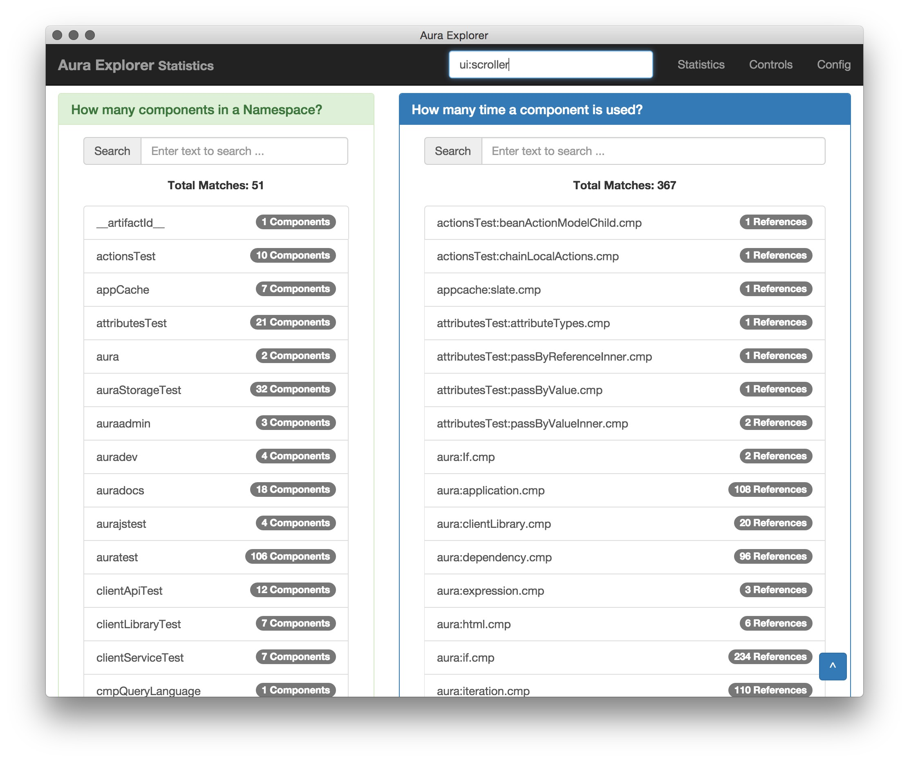

# Salesforce Aura Explorer
This application allows you to quickly explore Aura components with information such as dependencies, references as well as attributes.


### Features
I find the lack of good documentation in Aura quite unpleasant. Even though we have an Aura documentation page, it's extremely slow.

This application built on Node Webkit which lets you run it on local machine. This enables you to search through Aura components quickly and display information such as component attributes, component dependencies, usages.


### Links
+ [Salesforce Aura Github](https://github.com/forcedotcom/aura)
+ [Salesforce Documentation Page](http://demo.auraframework.org/auradocs#reference)


### How to install & open
```
	#clone it
	git clone https://github.com/synle/aura_autocomplete_sublime.git

	#need to have nw (node webkit):
	#FYI: more info here at https://github.com/nwjs/nw.js/wiki/How-to-run-apps
	#1 time install only
	npm install -g nw

	#run the app
	npm start
```


### Ways of setting up Aura Upstream
```
	#to link aura-master upstream to other directory, use this
	ln -s path-to-your-local-aura aura-master

	#to download the latest zip, run this
	#everytime you run this, current content of aura-master 
	#will be wiped out
	npm run get_aura_upstream
```


### Required packges to compile and run Aura Explorer
```
	#First time : run only once.
	#required dependencies for running the native app
	npm install -g nw

	#required dependencies for building
	npm install -g gulp
```


### How to build and run on local machine
```
	#Followed the steps above in "Ways of setting up Aura Upstream"
	#to get the aura-master upstream set up

	#rebuild meta data
	npm run pkg

	#to start the app
	npm start


	#if you are a developer and want to play with the code, you
	#can run gulp dev to keep the background job that watch
	#for changes and compile resource file
	npm run dev
```


#### Screenshots:
Statistics allows you to look at how many components are there under a namespace as well as how many times a component is being used.



On the control page you can look at a component's attribute as well as how it's being used in other places

Attribute information


Dependencies: information about which components are being used. And with the toggle you can quickly choose to see the information in Table view or XML view.


Event Information


Imports Information


Handlers Information


Methods Information


Usages: where is this component being used elsewhere. And with the toggle you can quickly choose to see the information in Table view or XML view.


Sample Terminal Output for running meta data generation
